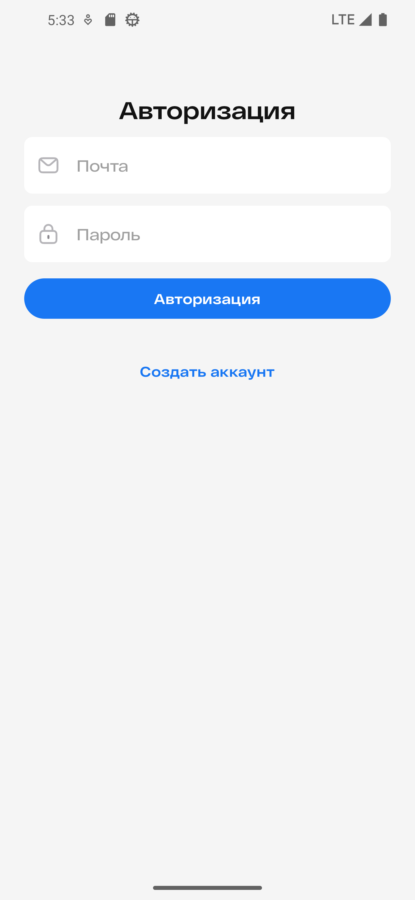
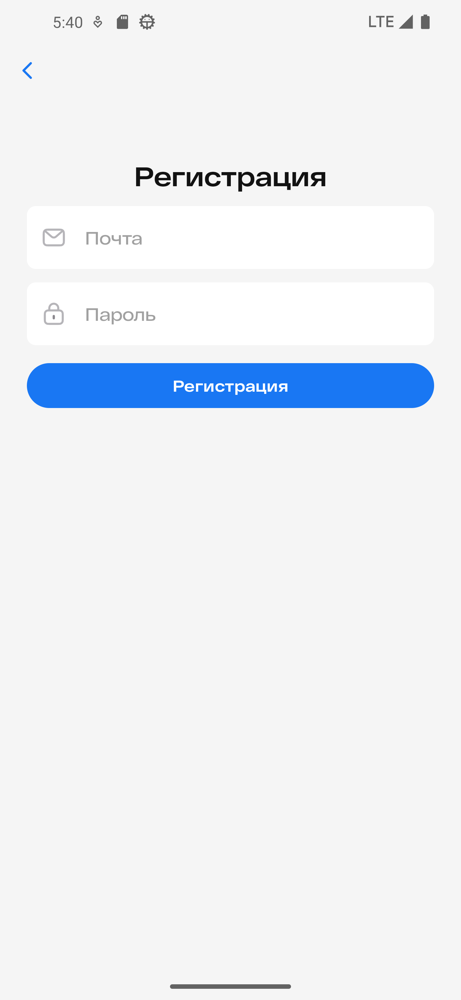
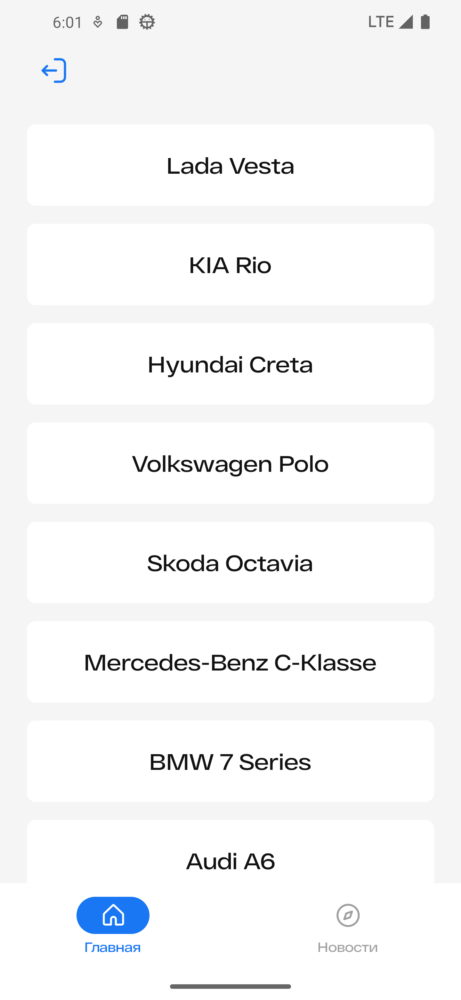
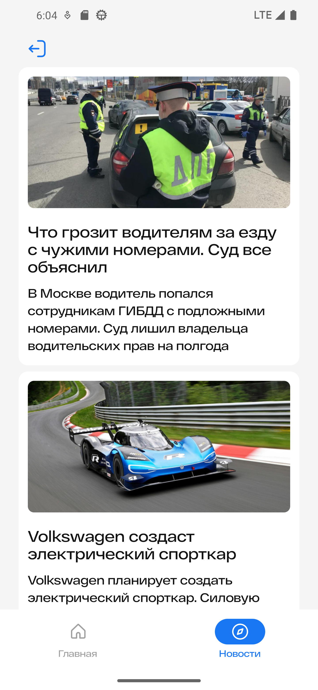
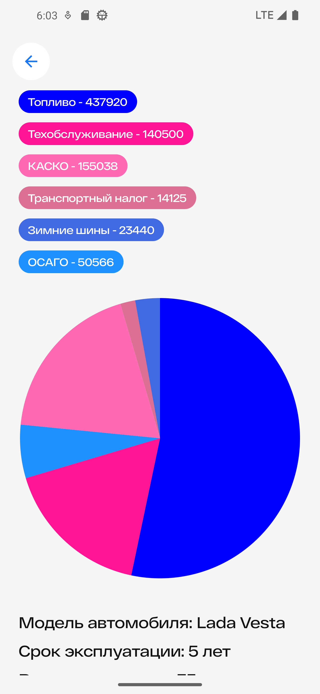
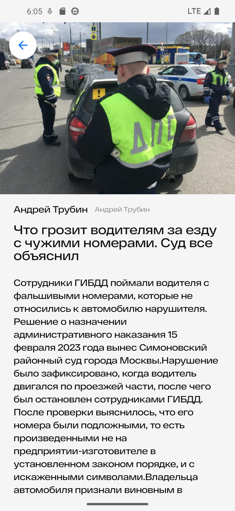
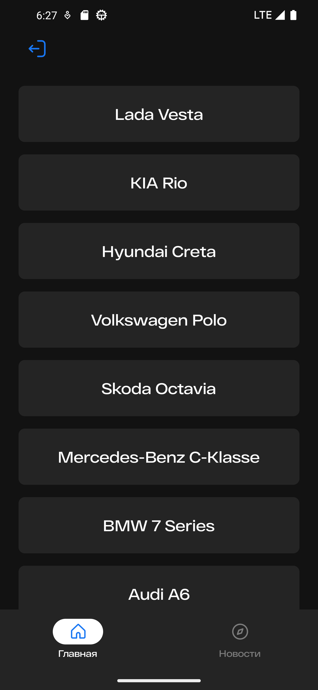

# AutoAnalyze Android App

## Screenshots

## Authentication screens

|                      Authorization                       |                      Registration                       |
|:--------------------------------------------------------:|:-------------------------------------------------------:|
|  |  |

## Main screens

|                           Home                           |                          News                           |
|:--------------------------------------------------------:|:-------------------------------------------------------:|
|     |          |

## Details screens

|                       Cars details                       |                      News details                       |
|:--------------------------------------------------------:|:-------------------------------------------------------:|
|   |  |

## Light/Dark themes

|                       Light Theme                        |                       Dark theme                        |
|:--------------------------------------------------------:|:-------------------------------------------------------:|
|     |     |

## Topics
* DI
* Navigation
* Architecture
* Paging
* Theming
* Single-module
* Compose Based UI
* Authentication with Firebase

## My contacts
* [VK](https://vk.com/ndynagn)
* [Telegram](https://t.me/gen_aa)